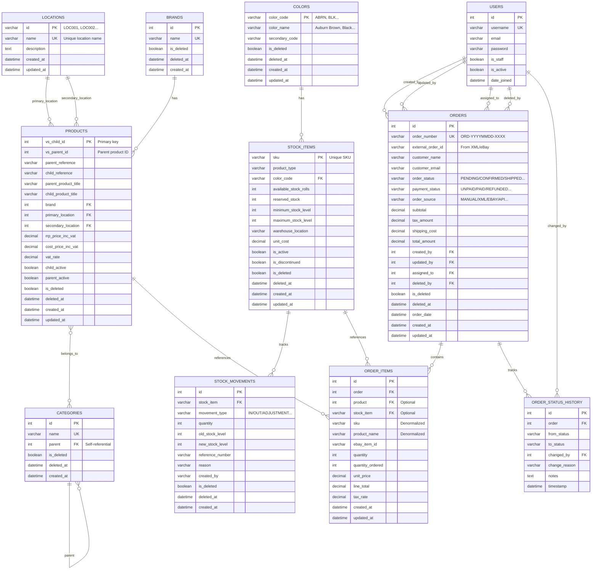

# Database Schema Overview

**Last Updated:** February 12, 2026  
**Project:** Inventory Management System

## Table of Contents
1. [System Architecture](#system-architecture)
2. [Entity Relationship Diagram](#entity-relationship-diagram)
3. [Table Details](#table-details)
4. [Data Flow & Business Logic](#data-flow--business-logic)
5. [Soft Delete Implementation](#soft-delete-implementation)
6. [Key Relationships](#key-relationships)

---

## System Architecture

The Inventory Management System is built on Django and consists of **4 main modules**:

1. **Products Module** - Product catalog, categories, brands, and locations
2. **Colors Module** - Color definitions for stock items
3. **Stock Module** - Inventory tracking and stock movements
4. **Orders Module** - Order processing and fulfillment

All tables implement **soft delete** functionality for data retention and audit compliance.

---

## Entity Relationship Diagram



---

## Table Details

### 1. Products Module

#### 1.1 Locations Table (`locations`)
**Purpose:** Manage physical storage locations for products

| Field | Type | Description |
|-------|------|-------------|
| `id` | VARCHAR(10) PK | Auto-generated: LOC001, LOC002... |
| `name` | VARCHAR(100) UNIQUE | Location name |
| `description` | TEXT | Additional details |
| `created_at` | DATETIME | Creation timestamp |
| `updated_at` | DATETIME | Last update timestamp |

**Key Features:**
- Custom alphanumeric primary key (LOC001, LOC002...)
- Auto-increments on save
- No soft delete (locations are permanent)

---

#### 1.2 Brands Table (`brands`)
**Purpose:** Product brand management

| Field | Type | Description |
|-------|------|-------------|
| `id` | INTEGER PK | Auto-increment |
| `name` | VARCHAR(100) UNIQUE | Brand name |
| `is_deleted` | BOOLEAN | Soft delete flag |
| `deleted_at` | DATETIME | Deletion timestamp |
| `created_at` | DATETIME | Creation timestamp |

**Relationships:**
- Has many Products (One-to-Many)

**Methods:**
- `soft_delete()` - Soft delete the brand
- `restore()` - Restore deleted brand
- `hard_delete()` - Permanent deletion

---

#### 1.3 Categories Table (`categories`)
**Purpose:** Hierarchical product categorization

| Field | Type | Description |
|-------|------|-------------|
| `id` | INTEGER PK | Auto-increment |
| `name` | VARCHAR(100) UNIQUE | Category name |
| `parent` | INTEGER FK | Self-referential parent category |
| `is_deleted` | BOOLEAN | Soft delete flag |
| `deleted_at` | DATETIME | Deletion timestamp |
| `created_at` | DATETIME | Creation timestamp |

**Relationships:**
- Self-referential (parent-child hierarchy)
- Many-to-Many with Products

**Methods:**
- `soft_delete()` - Soft delete category
- `restore()` - Restore deleted category
- `hard_delete()` - Permanent deletion

---

#### 1.4 Products Table (`products`)
**Purpose:** Main product catalog (based on Product Master Excel)

| Field | Type | Description |
|-------|------|-------------|
| `vs_child_id` | INTEGER PK | Unique child product ID |
| `vs_parent_id` | INTEGER | Parent product grouping |
| `parent_reference` | VARCHAR(50) | Parent SKU reference |
| `child_reference` | VARCHAR(50) | Child SKU reference |
| `parent_product_title` | VARCHAR(500) | Parent product name |
| `child_product_title` | VARCHAR(500) | Specific product variant name |
| `brand` | INTEGER FK | Foreign key to Brands |
| `primary_location` | VARCHAR(10) FK | Main storage location |
| `secondary_location` | VARCHAR(10) FK | Backup storage location |
| `rrp_price_inc_vat` | DECIMAL(10,2) | Retail price |
| `cost_price_inc_vat` | DECIMAL(10,2) | Cost price |
| `vat_rate` | DECIMAL(5,2) | VAT percentage (default 20%) |
| `child_active` | BOOLEAN | Product variant active flag |
| `parent_active` | BOOLEAN | Parent product active flag |
| `is_deleted` | BOOLEAN | Soft delete flag |

**Relationships:**
- Belongs to Brand (Many-to-One)
- Has primary Location (Many-to-One)
- Has secondary Location (Many-to-One)
- Has many Categories (Many-to-Many)
- Referenced by OrderItems (One-to-Many)

**Key Properties:**
- `is_active` - Returns True if both parent and child active
- `effective_price` - Returns RRP or cost price

**Indexes:**
- `vs_parent_id`, `parent_reference`, `child_reference`
- `child_active`, `parent_active`

---

### 2. Colors Module

#### 2.1 Colors Table (`colors`)
**Purpose:** Color definitions for stock items (based on Excel Colours sheet)

| Field | Type | Description |
|-------|------|-------------|
| `color_code` | VARCHAR(10) PK | Abbreviation code (ABRN, BLK...) |
| `color_name` | VARCHAR(100) | Full color name |
| `secondary_code` | VARCHAR(10) | Optional secondary code |
| `is_deleted` | BOOLEAN | Soft delete flag |
| `deleted_at` | DATETIME | Deletion timestamp |

**Relationships:**
- Has many StockItems (One-to-Many)

**Key Features:**
- Uses color_code as primary key
- Custom manager with soft delete support

---

### 3. Stock Module

#### 3.1 Stock Items Table (`stock`)
**Purpose:** Inventory management (based on Current Stock Excel)

| Field | Type | Description |
|-------|------|-------------|
| `sku` | VARCHAR(50) PK | Unique stock keeping unit |
| `product_type` | VARCHAR(20) | Product type identifier |
| `color_code` | VARCHAR(10) FK | Foreign key to Colors |
| `available_stock_rolls` | INTEGER | Current available stock |
| `reserved_stock` | INTEGER | Stock reserved for orders |
| `minimum_stock_level` | INTEGER | Reorder threshold |
| `maximum_stock_level` | INTEGER | Maximum capacity |
| `warehouse_location` | VARCHAR(50) | Physical location |
| `unit_cost` | DECIMAL(10,2) | Cost per unit |
| `is_active` | BOOLEAN | Active status |
| `is_discontinued` | BOOLEAN | Discontinued flag |

**Relationships:**
- Belongs to Color (Many-to-One)
- Has many StockMovements (One-to-Many)
- Referenced by OrderItems (One-to-Many)

**Key Properties:**
- `total_available_stock` - Available minus reserved
- `is_low_stock` - True if below minimum level
- `stock_status` - Returns status string
- `stock_value` - Calculates total inventory value

**Methods:**
- `reserve_stock(quantity)` - Reserve stock for order
- `release_stock(quantity)` - Release reserved stock
- `adjust_stock(quantity, reason)` - Manual stock adjustment

**Indexes:**
- `product_type`, `color`, `is_active`, `available_stock_rolls`

---

#### 3.2 Stock Movements Table (`stock_movements`)
**Purpose:** Audit trail for all stock changes

| Field | Type | Description |
|-------|------|-------------|
| `id` | INTEGER PK | Auto-increment |
| `stock_item` | VARCHAR(50) FK | Foreign key to StockItems |
| `movement_type` | VARCHAR(20) | IN/OUT/TRANSFER/ADJUSTMENT... |
| `quantity` | INTEGER | Change amount (+ or -) |
| `old_stock_level` | INTEGER | Stock before change |
| `new_stock_level` | INTEGER | Stock after change |
| `reference_number` | VARCHAR(100) | Order/transfer reference |
| `reason` | VARCHAR(200) | Movement reason |
| `created_by` | VARCHAR(100) | User who made change |

**Movement Types:**
- `IN` - Stock received
- `OUT` - Stock dispatched
- `TRANSFER` - Location transfer
- `ADJUSTMENT` - Manual adjustment
- `RESERVED` - Reserved for order
- `RELEASED` - Reservation released
- `DAMAGED` - Damaged stock
- `RETURNED` - Customer return

**Relationships:**
- Belongs to StockItem (Many-to-One)

---

### 4. Orders Module

#### 4.1 Orders Table (`orders`)
**Purpose:** Customer order management

| Field | Type | Description |
|-------|------|-------------|
| `id` | INTEGER PK | Auto-increment |
| `order_number` | VARCHAR(50) UNIQUE | ORD-YYYYMMDD-XXXX format |
| `external_order_id` | VARCHAR(100) | External system ID (XML/eBay) |
| `customer_name` | VARCHAR(200) | Customer full name |
| `customer_email` | EMAIL | Customer email |
| `order_status` | VARCHAR(20) | Current order status |
| `payment_status` | VARCHAR(20) | Payment status |
| `order_source` | VARCHAR(50) | MANUAL/XML/EBAY/API/WEBSITE |
| `subtotal` | DECIMAL(12,2) | Sum before tax & shipping |
| `tax_amount` | DECIMAL(12,2) | Tax amount |
| `shipping_cost` | DECIMAL(10,2) | Shipping fee |
| `total_amount` | DECIMAL(12,2) | Final total |
| `created_by` | INTEGER FK | User who created order |
| `updated_by` | INTEGER FK | Last user to update |
| `assigned_to` | INTEGER FK | Assigned employee |
| `deleted_by` | INTEGER FK | User who deleted order |

**Order Status Values:**
- `PENDING` - New order
- `CONFIRMED` - Order confirmed
- `PROCESSING` - Being processed
- `SHIPPED` - Order shipped
- `DELIVERED` - Order delivered
- `CANCELLED` - Order cancelled
- `ON_HOLD` - Temporarily on hold

**Payment Status Values:**
- `UNPAID` - Not paid
- `PARTIAL` - Partially paid
- `PAID` - Fully paid
- `REFUNDED` - Refunded
- `FAILED` - Payment failed

**Source Values:**
- `MANUAL` - Manual entry
- `XML` - XML import
- `EBAY` - eBay integration
- `API` - API submission
- `WEBSITE` - Website order

**Relationships:**
- Has many OrderItems (One-to-Many)
- Has many OrderStatusHistory (One-to-Many)
- Belongs to User (created_by, updated_by, assigned_to, deleted_by)

**Key Methods:**
- `calculate_totals()` - Calculate order totals
- `confirm(user)` - Confirm pending order
- `start_processing(user)` - Mark as processing
- `mark_shipped(tracking, carrier, user)` - Mark as shipped
- `mark_delivered(user)` - Mark as delivered
- `cancel(reason, user)` - Cancel order

**Properties:**
- `item_count` - Total number of items
- `total_quantity` - Sum of all quantities
- `is_paid` - Whether fully paid
- `shipping_address` - Formatted shipping address
- `billing_address` - Formatted billing address

**Indexes:**
- `order_number`, `order_status`, `payment_status`
- `customer_email`, `order_date`, `created_at`

---

#### 4.2 Order Items Table (`order_items`)
**Purpose:** Individual line items within orders

| Field | Type | Description |
|-------|------|-------------|
| `id` | INTEGER PK | Auto-increment |
| `order` | INTEGER FK | Foreign key to Orders |
| `product` | INTEGER FK | Optional reference to Products |
| `stock_item` | VARCHAR(50) FK | Optional reference to StockItems |
| `sku` | VARCHAR(50) | SKU at time of order (denormalized) |
| `product_name` | VARCHAR(500) | Product name (denormalized) |
| `product_type` | VARCHAR(50) | Product type |
| `color_code` | VARCHAR(10) | Color code |
| `ebay_item_id` | VARCHAR(100) | eBay item ID if applicable |
| `quantity` | INTEGER | Current quantity |
| `quantity_ordered` | INTEGER | Original quantity ordered |
| `unit_price` | DECIMAL(10,2) | Price per unit |
| `line_total` | DECIMAL(12,2) | Total for line item |
| `tax_rate` | DECIMAL(5,2) | Tax rate |

**Relationships:**
- Belongs to Order (Many-to-One)
- References Product (Many-to-One, optional)
- References StockItem (Many-to-One, optional)

**Key Features:**
- Denormalized data for historical accuracy
- Supports both product catalog items and custom items
- Auto-calculates line_total on save

**Indexes:**
- `order + sku`, `sku`

---

#### 4.3 Order Status History Table (`order_status_history`)
**Purpose:** Audit trail for order status changes

| Field | Type | Description |
|-------|------|-------------|
| `id` | INTEGER PK | Auto-increment |
| `order` | INTEGER FK | Foreign key to Orders |
| `from_status` | VARCHAR(20) | Previous status |
| `to_status` | VARCHAR(20) | New status |
| `changed_by` | INTEGER FK | User who made change |
| `change_reason` | VARCHAR(200) | Reason for change |
| `notes` | TEXT | Additional notes |
| `timestamp` | DATETIME | When change occurred |

**Relationships:**
- Belongs to Order (Many-to-One)
- Belongs to User (Many-to-One)

**Indexes:**
- `order + timestamp` (descending)

---

## Data Flow & Business Logic

### Order Processing Workflow

```
1. ORDER CREATION
   ├─ Source: Manual/XML/eBay/API/Website
   ├─ Status: PENDING
   └─ Payment: UNPAID

2. ORDER CONFIRMATION
   ├─ Employee reviews order
   ├─ Stock availability checked
   ├─ Status: PENDING → CONFIRMED
   └─ OrderStatusHistory record created

3. ORDER PROCESSING
   ├─ Employee assigned (assigned_to)
   ├─ Stock reserved (StockItem.reserve_stock())
   ├─ StockMovement records created (RESERVED)
   ├─ Status: CONFIRMED → PROCESSING
   └─ OrderStatusHistory updated

4. ORDER FULFILLMENT
   ├─ Items picked from warehouse
   ├─ Stock levels reduced (StockMovement: OUT)
   ├─ Reserved stock released
   ├─ Shipping label generated
   ├─ Status: PROCESSING → SHIPPED
   └─ tracking_number & carrier set

5. ORDER DELIVERY
   ├─ Carrier confirms delivery
   ├─ Status: SHIPPED → DELIVERED
   └─ OrderStatusHistory updated

ALTERNATIVE: ORDER CANCELLATION
   ├─ Can occur at PENDING/CONFIRMED/PROCESSING/SHIPPED
   ├─ Employee must manually release reserved stock
   ├─ StockMovement records created (RELEASED)
   ├─ Status: * → CANCELLED
   └─ OrderStatusHistory tracks reason
```

### Stock Management Flow

```
1. STOCK RECEIPT
   ├─ New stock arrives from supplier
   ├─ StockItem.adjust_stock(+quantity, "Purchase Order XYZ")
   ├─ StockMovement created (IN)
   └─ available_stock_rolls increased

2. STOCK RESERVATION
   ├─ Order confirmed
   ├─ StockItem.reserve_stock(quantity)
   ├─ reserved_stock increased
   ├─ StockMovement created (RESERVED)
   └─ total_available_stock reduced

3. STOCK DISPATCH
   ├─ Order shipped
   ├─ available_stock_rolls decreased
   ├─ reserved_stock decreased
   ├─ StockMovement created (OUT)
   └─ Reference to order_number

4. STOCK ADJUSTMENT
   ├─ Physical inventory count
   ├─ StockItem.adjust_stock(±quantity, "Annual stocktake")
   ├─ StockMovement created (ADJUSTMENT)
   └─ Audit trail maintained

5. LOW STOCK ALERTS
   ├─ System checks: available_stock_rolls <= minimum_stock_level
   ├─ StockItem.is_low_stock property
   └─ Reorder triggered
```

### Product-Stock Relationship

```
PRODUCTS (Catalog)
   ├─ Defines: What can be sold
   ├─ Attributes: Pricing, descriptions, images
   └─ vs_child_id: Unique product identifier

STOCK_ITEMS (Inventory)
   ├─ Defines: What is physically available
   ├─ Attributes: Quantities, location, cost
   └─ SKU: Unique inventory identifier

ORDER_ITEMS (Transactions)
   ├─ References: Both Product & StockItem (optional)
   ├─ Denormalized: SKU, product_name, unit_price
   └─ Purpose: Historical accuracy of order
```

---

## Soft Delete Implementation

All major tables implement **soft delete** for data retention and compliance:

### Standard Soft Delete Fields
```python
is_deleted = models.BooleanField(default=False)
deleted_at = models.DateTimeField(null=True, blank=True)
```

### Manager Implementation
```python
# Default manager - excludes deleted records
objects = CustomManager()  # Returns only is_deleted=False

# Access all records including deleted
all_objects = models.Manager()

# Query methods
Model.objects.all()           # Active records only
Model.objects.with_deleted()  # All records
Model.objects.only_deleted()  # Deleted records only
```

### Tables with Soft Delete
- ✅ `brands`
- ✅ `categories`
- ✅ `products`
- ✅ `colors`
- ✅ `stock` (stock_items)
- ✅ `stock_movements`
- ✅ `orders`

### Tables WITHOUT Soft Delete
- ❌ `locations` (permanent infrastructure)
- ❌ `order_items` (cascade with order)
- ❌ `order_status_history` (permanent audit trail)

### Soft Delete Methods
```python
# Soft delete
instance.soft_delete()
# Sets: is_deleted=True, deleted_at=timezone.now()

# Restore
instance.restore()
# Sets: is_deleted=False, deleted_at=None

# Permanent delete
instance.hard_delete()
# Actually removes from database
```

---

## Key Relationships

### Foreign Key Relationships

1. **Products → Brands**
   - Type: Many-to-One
   - Constraint: SET_NULL (preserves products if brand deleted)
   
2. **Products → Locations** (2 relationships)
   - Primary Location: Many-to-One
   - Secondary Location: Many-to-One
   - Constraint: SET_NULL

3. **Products ←→ Categories**
   - Type: Many-to-Many
   - Junction table: `products_categories`

4. **StockItems → Colors**
   - Type: Many-to-One
   - Constraint: CASCADE
   - Uses: `color_code` as foreign key

5. **StockMovements → StockItems**
   - Type: Many-to-One
   - Constraint: CASCADE

6. **Orders → Users** (4 relationships)
   - created_by: Many-to-One
   - updated_by: Many-to-One
   - assigned_to: Many-to-One
   - deleted_by: Many-to-One
   - All: SET_NULL

7. **OrderItems → Orders**
   - Type: Many-to-One
   - Constraint: CASCADE

8. **OrderItems → Products**
   - Type: Many-to-One
   - Constraint: SET_NULL (optional, denormalized data preserved)

9. **OrderItems → StockItems**
   - Type: Many-to-One
   - Constraint: SET_NULL (optional)

10. **OrderStatusHistory → Orders**
    - Type: Many-to-One
    - Constraint: CASCADE

11. **OrderStatusHistory → Users**
    - Type: Many-to-One
    - Constraint: SET_NULL

### Cascade Behavior Summary

| Relationship | On Delete |
|--------------|-----------|
| Product → Brand | SET_NULL |
| Product → Location | SET_NULL |
| StockItem → Color | CASCADE |
| StockMovement → StockItem | CASCADE |
| Order → User (all) | SET_NULL |
| OrderItem → Order | CASCADE |
| OrderItem → Product | SET_NULL |
| OrderItem → StockItem | SET_NULL |
| OrderStatusHistory → Order | CASCADE |
| OrderStatusHistory → User | SET_NULL |

---

## Database Indexes

### Products
- `vs_parent_id`, `parent_reference`, `child_reference`
- `child_active`, `parent_active`

### Stock Items
- `product_type`, `color`, `is_active`
- `available_stock_rolls`

### Orders
- `order_number` (unique)
- `order_status`, `payment_status`
- `customer_email`, `order_date`
- `created_at` (descending)

### Order Items
- Composite: `order + sku`
- `sku`

### Order Status History
- Composite: `order + timestamp` (descending)

---

## Notes & Best Practices

1. **Denormalization in OrderItems**
   - SKU, product_name, and unit_price are denormalized
   - Ensures historical order accuracy even if products change

2. **Stock Reservation Pattern**
   - Stock is reserved when order is confirmed/processing
   - Reserved stock is NOT available for new orders
   - Stock is released when order ships or is cancelled

3. **Audit Trails**
   - StockMovements: All stock changes
   - OrderStatusHistory: All status transitions
   - User tracking: created_by, updated_by, changed_by fields

4. **Soft Delete Strategy**
   - Preserves data for reporting and compliance
   - Prevents cascading deletions
   - Can be restored if deleted by mistake

5. **Auto-generated IDs**
   - Locations: LOC001, LOC002...
   - Orders: ORD-20260212-0001, ORD-20260212-0002...

6. **Color Code as Primary Key**
   - Colors table uses `color_code` (varchar) as PK
   - Foreign keys reference `color_code` field
   - Improves readability: "BLK" vs integer ID

---

## Summary Statistics

| Module | Tables | Soft Delete | Foreign Keys |
|--------|--------|-------------|--------------|
| Products | 4 | 3 of 4 | 5 |
| Colors | 1 | 1 of 1 | 0 |
| Stock | 2 | 2 of 2 | 2 |
| Orders | 3 | 1 of 3 | 11 |
| **Total** | **10** | **7 of 10** | **18** |

---

**Document Version:** 1.0  
**Generated:** February 12, 2026
